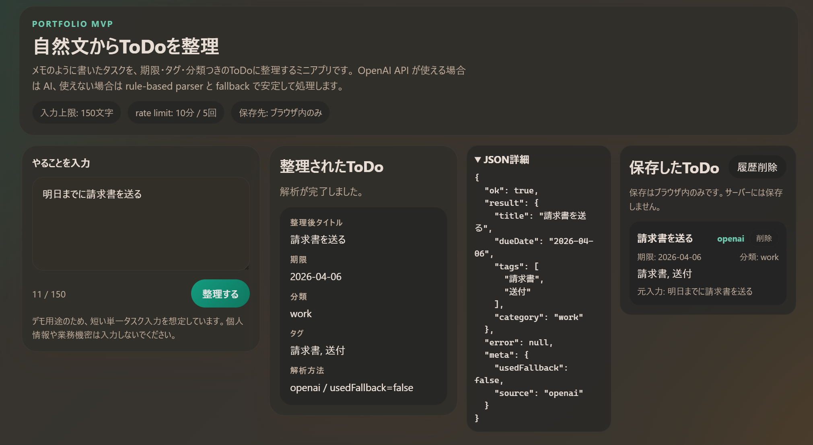

# 自然文ToDo整理ツール

自然文の依頼やメモを、期限・分類つきToDoに整理するツールです。

就活用ポートフォリオとして、単なる AI デモではなく、

- 自然文入力の構造化
- OpenAI と rule-based fallback の併用
- UI からの操作
- 入力制限、レート制限、ログ最小化
- テストと評価データ

まで含めて、小さく実務寄りにまとめています。

このテーマを選んだ理由は、AI機能を組み込んだ業務ツール開発の需要が高いと感じたこと、単に LLM を呼ぶだけでなく fallback や評価まで含めた実装力を示したかったこと、そして今後の実務で求められやすい自然文入力の構造化・API化・壊れにくい設計を一通り経験したかったためです。

## What It Does

- 日本語の自然文タスクを構造化JSONへ変換します
- OpenAI API を使える場合は AI で解析します
- AI が使えない、または失敗した場合は rule-based parser に落とします
- parser も失敗した場合は fallback を返します
- レスポンスの `meta` で、どの経路を使ったかを返します

## UI Screenshot

README 用スクリーンショット:


整理結果まで含めた画面:



## How To Use

1. 口語のままタスクを入力します  
   例: `明後日までに請求書を送る`
2. `整理する` を押します
3. `title / dueDate / tags / category` に整理された結果を確認します
4. 必要なら `JSON詳細` で API レスポンスも確認できます

## Response Shape

```json
{
  "ok": true,
  "result": {
    "title": "請求書を送る",
    "dueDate": "2026-04-04",
    "tags": ["請求書", "送付"],
    "category": "work"
  },
  "error": null,
  "meta": {
    "usedFallback": false,
    "source": "openai"
  }
}
```

`meta.source` は次のいずれかです。

- `openai`
- `rule_based`
- `fallback`

## AI And Rule-Based Roles

- `openai`
  曖昧な自然文から、より自然な `title` や `tags` を作る役割です
- `rule_based`
  OpenAI が使えないときでも壊さずに返すための通常フォールバックです
- `fallback`
  parser も失敗したときに、最低限の結果を返す最後の保険です
- `dueDate`
  相対日付は AI の揺れを減らすため、必要に応じて rule-based 側で補正します

## Why This Is Practical

- `HTTP層` と `業務ロジック` を分離しています
- `AI本体` と `fallback` を分離しています
- `examples.json` を評価データとして使っています
- `meta.usedFallback` / `meta.source` で結果の品質を追えます
- 生入力をそのままログに残さず、`textLength` など最小限だけ記録します
- `.env` と `.gitignore` を前提に、秘密情報をコードに直書きしません
- AI に全部任せず、日付のような揺れやすい箇所は deterministic に補正します

## Project Structure

- `server.js`
  API入口、入力検証、レート制限、レスポンス制御
- `aiClient.js`
  OpenAI API 呼び出し
- `parser.js`
  通常時の rule-based parser
- `fallback.js`
  parser 失敗時の最低限結果生成
- `utils.js`
  共通の小さい補助処理
- `examples.json`
  評価用データ
- `parser.test.js`
  parser 単体テスト
- `fallback.test.js`
  fallback 単体テスト
- `eval.js`
  `examples.json` を使った一括評価

## Safety Choices

- APIキーはクライアントに置かず、バックエンドからのみ OpenAI を呼びます
- `.env` は Git 管理しません
- 入力文字数は `MAX_INPUT_LENGTH` で制限します
- `/parse-task` はレート制限をかけています
- ログには生の入力全文を残しません
- OpenAI が失敗しても、rule-based parser と fallback で結果を返す設計です

## Demo Policy

- このプロジェクトは就活用の制限付きデモを想定しています
- 常時無制限公開ではなく、必要時のみ動かす前提です
- 入力は `150文字` までに制限しています
- `/parse-task` には `10分 / 5回` のレート制限があります
- 個人情報や業務機密の入力は想定していません
- 履歴保存はブラウザ内のみで、サーバーには保存しません

## Current Limits

- 単一タスク入力を想定しています
- 日付処理は限定的です
- rule-based parser は `examples.json` に強く最適化されています
- OpenAI API を使う場合も、厳密な本番運用前提ではなく就活用ポートフォリオ向けの最小構成です

## Evaluation

現時点のローカル確認結果:

- `npm test` -> `7/7 tests passed`
- `npm run test:fallback` -> `3/3 tests passed`
- `npm run eval` -> `13/13 examples passed`

## Setup

### 1. Install

```bash
npm install
```

### 2. Create `.env`

`.env.example` を元に `.env` を作成します。

```env
PORT=3000
JSON_LIMIT=16kb
MAX_INPUT_LENGTH=150
RATE_LIMIT_WINDOW_MS=600000
RATE_LIMIT_MAX_REQUESTS=5
PARSER_BASE_DATE=
OPENAI_API_KEY=
OPENAI_MODEL=gpt-5.4-nano
OPENAI_TIMEOUT_MS=8000
```

OpenAI を使わない場合、`OPENAI_API_KEY` は空でも動きます。その場合は `rule_based` / `fallback` 経由で処理します。

### 3. Start

```bash
npm run dev
```

## Commands

```bash
npm run dev
npm test
npm run test:fallback
npm run eval
```

## Example Request

```bash
curl -X POST http://localhost:3000/parse-task \
  -H "Content-Type: application/json" \
  -d "{\"text\":\"明日までに請求書を送る\"}"
```

## Portfolio Note

このプロジェクトは、AI機能そのものだけでなく、

- 入出力設計
- fallback 設計
- eval
- ログ最小化
- レート制限
- `.env` による秘密情報管理

まで含めて、実務寄りに小さくまとめることを目的にしています。

また、AI機能を組み込んだ業務ツール開発は今後も需要が高いと考え、単に OpenAI API を呼ぶだけで終わらせず、fallback・評価データ・レート制限・ログ最小化まで含めて、実務で使われやすい構成を小さく再現することを意識しました。

公開デモは就活用を想定し、常時無制限公開ではなく、制限つき運用を前提にしています。

## GitHub Pre-Publish Check

- `.env` は `.gitignore` に含めています
- APIキーは `.env.example` と README の空欄例だけにし、実値はコミットしません
- OpenAI の呼び出しはサーバー側だけで行い、クライアントにはキーを置きません
- 公開前に `npm test` / `npm run test:fallback` / `npm run eval` を通す前提です
